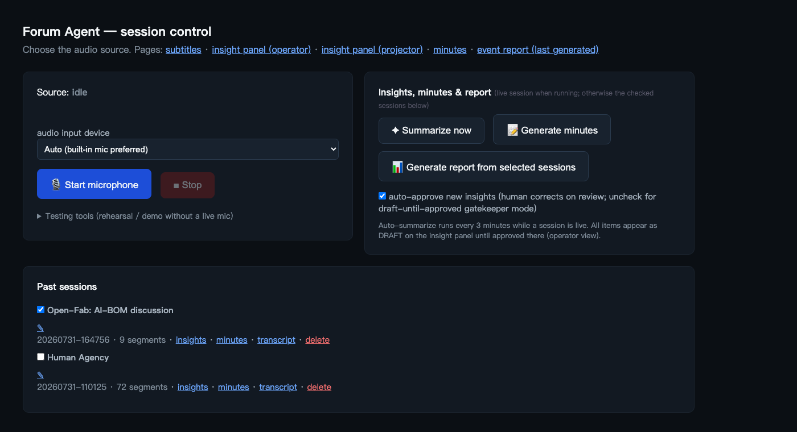
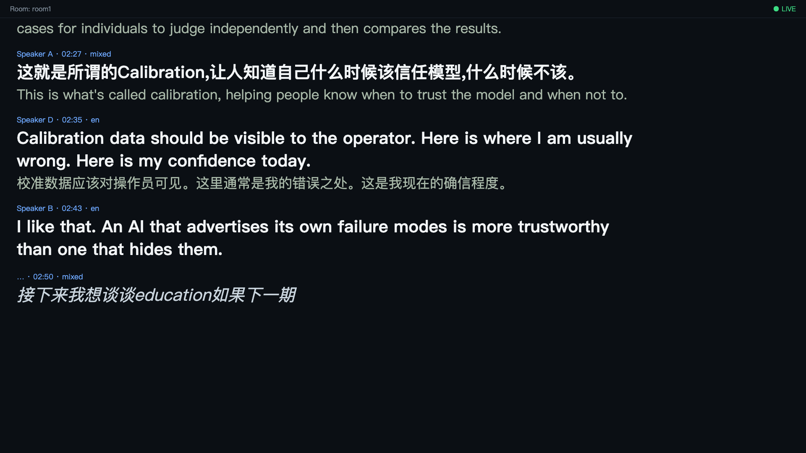

# forum-agent

Built for the [AI Vision Forum Shenzhen 2026](https://shenzhen2026.visionforum.ai)
(Oct 14–15, Zhuhai) — an open-source AI participant for bilingual (中文/English) forums. It listens to room audio, produces a
diarized, code-switching-aware transcript with live bilingual subtitles —
**fully locally**: no cloud APIs, no internet needed at the venue. Speakers
are labelled only `Speaker A/B/C…` (Chatham House Rule); all AI output is a
draft for human review.

Status: **M1 (proof of concept), extended** — single-room pipeline: audio
(file replay **or live microphone**) → diarized bilingual transcript (JSONL)
→ live subtitle web page, with a web control console for choosing the audio
source and input device. See [docs/SPEC.md](docs/SPEC.md) for the full
requirement spec (C1–C10) and [PROMPT.md](PROMPT.md) for the build plan
(next: insight engine, operator console, minutes, two-room mode).

## Operating at the venue (no terminal needed)

Double-click **`Forum Agent.command`** to start — it opens a terminal window
that supervises the app: if the app exits (the console's "Restart app"
button, a crash, or an update), it restarts automatically in ~2 seconds.
Close that window to shut everything down. Operators restart the app from
the console's Maintenance section; they never need a shell.

## Screenshots

Operator console — audio source, generation controls (live session when
running, otherwise the checked sessions), and the session archive:



Live bilingual subtitles (from the acceptance run):



## Architecture (M1)

```
WAV replay (wall-clock pinned) OR live mic (auto-gain + Silero neural VAD)
  → VAD segmenter with 0.5s pre-roll        (forum_agent/segmenter.py, vad.py)
  → Whisper large-v3-turbo via mlx-whisper  (forum_agent/asr.py)
  → ECAPA-TDNN speaker embeddings + online clustering (forum_agent/diarize.py)
  → append-only JSONL {t_start, t_end, speaker_id, lang, text}
  → WebSocket → dark full-screen subtitle page (forum_agent/static/)
  → async translation via managed mlx-lm server (forum_agent/llm.py)
```

Subtitles show partials within ~2 s; translations attach when ready, so the
display degrades to ASR-only if the LLM lags. LLM prompts live in
[prompts/](prompts/) for non-developer tuning.

## Model choices (benchmarked on M3 Max, 128 GB)

| Role | Choice | Why |
|---|---|---|
| ASR | `mlx-community/whisper-large-v3-turbo` | Apple-silicon (MLX) build; transcribes 中英 code-switched utterances verbatim; measured end-of-utterance→subtitle lag ≤ 0.5 s |
| Diarization | `speechbrain/spkrec-ecapa-voxceleb` | On the fixture: intra-speaker cosine ≥ 0.81, inter-speaker ≤ 0.63 → threshold 0.72 gave 71/71 correct labels |
| Translation & insights | `mlx-community/Qwen3-8B-4bit` via a managed `mlx_lm.server` | MLX benchmarked ~1.8× faster generation than Ollama/llama.cpp here (46 vs 25 tok/s); ~0.5 s per subtitle translation; acceptance re-run: max lag 2.62 s. Large models starve Whisper on the shared GPU (ADR 0001), so the live path stays 8B. |
| Report | `mlx-community/Qwen2.5-32B-Instruct-4bit` | Batch job after sessions end — quality over latency. Same MLX server, per-request model. |

## Quickstart

Requires: macOS on Apple silicon, Python 3.12, `ffmpeg`. All models (ASR,
LLM) download automatically from Hugging Face on first use — run each
feature once with internet before an offline event; afterwards everything
runs fully offline from the local cache. Ollama is no longer needed.

```bash
python3 -m venv .venv && .venv/bin/pip install -r requirements.txt
# generate the ~10-min synthetic bilingual meeting fixture (uses macOS `say`)
.venv/bin/python -m forum_agent.fixture.generate_fixture
# start the persistent server + web control console
.venv/bin/python -m forum_agent.server
```

The browser is only a viewer — recording, transcription, translation, and
auto-insights all run in the server process, so closing every browser window
does not interrupt a session. Reopen the console anytime to catch up.

Open <http://127.0.0.1:8710/control>: pick the audio input device, then
"Start microphone" for live capture or "Start test audio file" for the
fixture replay. Subtitles: <http://127.0.0.1:8710/subtitles?room=room1>
(add `&fs=48` to change font size). Transcript appears at
`data/room1_transcript.jsonl`. CLI alternative (one command, no console):
`.venv/bin/python -m forum_agent.replay data/fixture_meeting.wav --room room1`
or `--mic`.

Tests: `.venv/bin/pytest tests/` (units) and, after a replay,
`.venv/bin/python tests/acceptance_m1.py` (M1 acceptance criteria).

## 中文快速上手

系统要求：Apple 芯片 Mac、Python 3.12、`ffmpeg`。所有模型（语音识别与大模型）
首次使用时自动从 Hugging Face 下载——线下活动前请先联网把各功能跑一遍，之后即可
完全离线运行。不再需要安装 Ollama。

```bash
python3 -m venv .venv && .venv/bin/pip install -r requirements.txt
# 生成约 10 分钟的中英混说合成会议音频（使用 macOS 自带 `say` 语音合成）
.venv/bin/python -m forum_agent.fixture.generate_fixture
# 启动常驻服务器与网页控制台
.venv/bin/python -m forum_agent.server
```

浏览器打开控制台 <http://127.0.0.1:8710/control>：选择音频输入设备后，点
"Start microphone"（实时麦克风）或 "Start test audio file"（回放测试音频）。
字幕页 <http://127.0.0.1:8710/subtitles?room=room1>（加 `&fs=48` 可调字号）。逐字稿输出在 `data/room1_transcript.jsonl`，每行一条：
`{t_start, t_end, speaker_id, lang, text}`。发言人仅标注为 Speaker A/B/C
（查塔姆宫规则，不记录姓名）；全部处理均在本机完成，无任何云端调用。

运行测试：`.venv/bin/pytest tests/`；回放结束后运行
`.venv/bin/python tests/acceptance_m1.py` 验证 M1 验收标准（字幕延迟 < 3 秒、
逐字稿完整、双语覆盖）。

## License & contributing

Apache-2.0 (see [LICENSE](LICENSE)). Contributions require a
Developer Certificate of Origin sign-off: commit with `git commit -s`
(`Signed-off-by: Your Name <you@example.com>`), certifying
<https://developercertificate.org/>.
