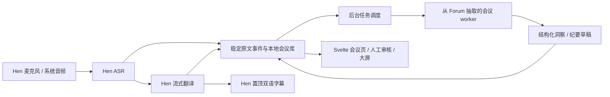

# Hen Local 与 Forum Agent 合并评估与建议

> 执行决策已更新：用户已确定先在本 Forum 仓库的 `codex/vision-forum-integration` 分支完成整个 AI Vision Forum 版，再派生 Minutes。后续以[详细工程方案](engineering/VISION_FORUM_ENGINEERING_PLAN_ZH.md)为准。本文保留为前一轮技术评估；其中立即新建 Minutes 仓库、提前迁出的建议已被新决策替代，不再作为执行步骤。

评估时间：2026-09-16。Hen Local 源码基线为 `4904269`，应用版本 `1.2.0-beta.4`；Forum Agent 基线为 `8c3168c`，另有本次对话中添加的本地翻译演示模式。本文是方案，尚未实施产品合并。Hen 仓库未修改，本次没有启动应用、麦克风或下载模型。

## 1. 建议的产品与仓库归属

根据最新产品方向，建议新建独立产品仓库 `Hen-Local/Hen-Local-Minutes`（暂名），以 Hen Translator 的 Tauri/Svelte 桌面基础为起点，导入 Forum 的会议能力。原 Translator 继续作为独立翻译产品维护，Forum 原仓库保留作上游参考。新产品复用 Hen 的音频入口、翻译、设置、模型管理、分发更新与账户实现；Forum Agent 提供会议洞察、人工审核、纪要与跨会议报告的业务基础。

AI Vision Forum 做成场景配置与模板：品牌、术语表、中英展示、匿名发言人规则、主持人视图、报告格式及多场 session 汇总。日常会议、课程、访谈可使用同一套核心能力。无需为每个活动维护长期分支或独立复制的应用；是否需要独立品牌安装包可以后续决定。

优先现在建立 Minutes 本地工作目录和独立 Git 仓库，远程仓库可在名称确定后创建。新产品统一 issue、版本和验收。首次抽取代码时记录来源 commit、保留许可证和归属，明确哪些修复回馈上游。优先按模块导入，不做两套应用源码的无边界堆叠。先在 Forum 的开发分支孵化也可行，但建议在最小闭环验证后迁出，不等整个产品完成；详见第 11 节。

新产品必须有独立的应用身份：productName、bundle ID、应用数据目录、Keychain service、登录回调 URL scheme、updater feed 和发布版本。账户基础设施与通用代码可以复用，但产品授权需明确配置，不能默认沿用 Translator 的 entitlement。这样 Minutes 与 Translator 才能并存，避免覆盖应用、会议资料或收到另一款产品的更新。模型缓存可按模型版本、格式及校验值受控共享，运行状态与会议数据分开保存。

新仓库导入 Hen 基线后增量添加会议模块。以下仅为后续整理方向，不要求第一步重命名所有内部 crate：

```text
Hen-Local-Minutes/
  hen-local-translator-shell/       # 复用桌面壳、Svelte 及浮窗；配置独立应用身份
  moxin-dora-bridge/                # 现有采集/数据流桥接
  hen-local-init/                  # 现有模型下载器，扩展可选模型包
  node-hub/                       # 保留 ASR、翻译节点
  crates/meeting-core/            # 新增：会议事件、存储、任务与状态机
  packages/contracts/             # 新增：版本化事件/结果 schema
  services/meeting-agent/         # 初期：从 Forum 抽出的无界面 Python worker
  profiles/ai-vision-forum/        # 场景配置、术语及输出模板
  supabase/                       # 复用账户体系，明确 Minutes 产品权限
  evals/meetings/                  # 同一批音频、预期结果与并发回归
```

## 2. 两个项目的实际能力

| 项目 | Hen Local 当前实现 | Forum Agent 当前实现 | 合并取舍 |
|---|---|---|---|
| 用户入口 | Tauri 2 + Svelte 5 桌面应用 | FastAPI + 静态 HTML 浏览器页面 | 以 Hen 桌面壳为主 |
| 音频输入 | 麦克风，macOS ScreenCaptureKit 系统音频 | 麦克风、回放及录音上传 | 保留 Hen 实时入口，增加统一录音导入 |
| 实时字幕 | 置顶可缩放浮窗、透明度、字号、锚点、流式译文 | 大屏字幕墙 | 保留 Hen 浮窗，新增同一数据驱动的大屏布局 |
| 会议理解 | 尚无结构化洞察/纪要模块 | 要点、共识、分歧、问题、行动项、纪要、活动报告 | 抽取 Forum 业务规则和提示词 |
| 人工审核 | 翻译产品设置为主 | 审核、编辑、隐藏、引用依据、草稿状态 | 保留逻辑，在 Svelte 实现统一界面 |
| 说话人 | 实际 ASR/字幕链路未实现声纹分离 | ECAPA 在线聚类，匿名 Speaker A/B | 作为可选会议能力，先重新评测 |
| 历史 | 内存字幕 history，停止时导出 Markdown | JSONL + 按 session 归档的文件 | 建立统一、持续持久化的会议资料库 |
| 模型管理 | 首次启动下载、进度及完成校验基础 | 首次调用自动下载与模型服务健康检查 | 扩展 Hen 下载器，现场运行前完成检查 |
| 打包与更新 | .app/DMG 脚本、Tauri updater、CI、账户与授权实现 | 本地 Python 环境及启动脚本 | 沿用 Hen 产品基础；正式发布仍需验收 |

依据：[Hen README](</Users/zenghaochen/WORKING/Hen Local/Hen-Local-Translator/README.md>)、[现有 workspace](</Users/zenghaochen/WORKING/Hen Local/Hen-Local-Translator/Cargo.toml:1>)、[Forum 管线](../forum_agent/pipeline.py)、[Forum 洞察引擎](../forum_agent/insights.py)。

## 3. 模型：保留分工，先对测，再定默认配置

| 任务 | Hen 当前配置 | Forum 当前配置 | 首轮整合建议 |
|---|---|---|---|
| macOS ASR | Qwen3-ASR-1.7B-8bit，经 Rust/OminiX-MLX | Whisper large-v3-turbo，经 Python mlx-whisper | 先保留 Hen Qwen ASR；Whisper 作为同音频对照后端，不同时常驻跑两遍 |
| macOS 翻译 | Qwen3.5-2B-MLX-4bit | Qwen3-8B-4bit | 默认保留 Hen 2B，短任务与流式字幕路径已存在；8B 做质量对照，不据参数量直接判定胜负 |
| 实时洞察 | 无 | Qwen3-8B-4bit，开启 thinking | 用 Forum 8B 复现基线；对比 2B 做短摘要的质量和耗时，再选默认。优先测试关闭长思考、限制输出和增量摘要 |
| 会后纪要/报告 | 无 | Qwen2.5-32B-Instruct-4bit | 先测试 8B 标准档能否满足要求；32B 为可选会后质量档，运行前资源检查，不默认下载/预加载 |
| 区分说话人 | 无实际 diarization | ECAPA-TDNN + 在线聚类 | 可选独立模块；支持说话人未知，不能凭 ASR 模型名称假定自带 diarization |
| 翻译朗读 | 当前主流程使用 Apple `say` | `say` 朗读已审核要点 | 复用 Hen 现有语音输出能力；不为合并默认加载另一套神经 TTS |
| Windows | SenseVoice-small int8 / sherpa-onnx + Qwen3-1.7B GGUF / llama.cpp | Apple Silicon 专用 | 保留平台后端接口；Windows 有移植代码，但不能按 macOS 完整能力承诺交付 |

模型型号依据：[Hen 下载器](</Users/zenghaochen/WORKING/Hen Local/Hen-Local-Translator/hen-local-init/src/main.rs:1187>)、[Windows 实现说明](</Users/zenghaochen/WORKING/Hen Local/Hen-Local-Translator/WINDOWS.md:7>)、[Forum 模型配置](../forum_agent/constants.py)。Hen 的 Rust crate 名 `qwen3_5_35b_mlx` 不代表实际加载的是 35B；当前默认权重是 2B。Qwen TTS 源码目录残留也不代表当前产品在运行它。

官方模型资料确认 Qwen3-ASR 的多语言识别定位、Qwen3.5-2B 和 Qwen3-8B 的不同模型身份；这些模型卡不能证明本机量化版在特定会议音频上的实际质量。最终选择应依据本项目的对比实验。[Qwen3-ASR](https://huggingface.co/Qwen/Qwen3-ASR-1.7B)、[Qwen3.5-2B](https://huggingface.co/Qwen/Qwen3.5-2B)、[Qwen3-8B](https://huggingface.co/Qwen/Qwen3-8B)、[SenseVoiceSmall](https://huggingface.co/FunAudioLLM/SenseVoiceSmall)。

两边都使用 MLX，不代表模型可以自动共享内存或同一个推理实例。Hen 是 Rust 嵌入式推理节点，Forum 是 Python `mlx-lm` HTTP 服务；模型架构、转换格式、tokenizer、chat template 和运行时版本需要分别核对。先统一 `ASRBackend` / `TranslateBackend` / `SummarizeBackend` 契约、模型目录和版本清单，避免为了“统一技术栈”立刻重写已工作的推理代码。

## 4. 最关键的缺口：字幕数据不等于会议记录

Hen 已有 `burst_id`、`commit_id`、`direction_epoch`，但这些是局部处理标识，不是完整会议协议：

- 音频/ASR 事件缺少持久 session ID、声源轨道及起止时间的完整传递。
- 翻译缓冲会拼接多个语音片段，再按文本边界提交；不能假设一段 ASR 对应一条译文。
- 最终 `SentenceUnit` 丢弃 commit ID，没有时间戳/说话人；传给前端的 `Sentence` 更只有原文和译文。
- 内存 history 上限为 10,000 句；导出读取这个显示缓存。默认 `transcript.md` 用覆盖写入，保存函数目前只在停止时调用；有“周期保存”设置字段不等于已经实现周期持久化。

依据：[内部句子结构](</Users/zenghaochen/WORKING/Hen Local/Hen-Local-Translator/moxin-dora-bridge/src/data.rs:58>)、[片段拼接逻辑](</Users/zenghaochen/WORKING/Hen Local/Hen-Local-Translator/node-hub/dora-qwen35-translator/src/transcript_buffer.rs:30>)、[UI Sentence](</Users/zenghaochen/WORKING/Hen Local/Hen-Local-Translator/hen-local-translator-shell/ui/src/lib/api.ts:117>)、[导出保存](</Users/zenghaochen/WORKING/Hen Local/Hen-Local-Translator/hen-local-translator-shell/src/app.rs:520>)、[停止时保存](</Users/zenghaochen/WORKING/Hen Local/Hen-Local-Translator/hen-local-translator-shell/src/app.rs:1108>)。

建议由 Rust meeting-core 作为会议数据的唯一写入入口，使用本地 SQLite 管理会议、事件、原文修订、译文、说话人、审核记录和后台任务；音频与导出文档另存文件。JSONL 继续作为导入导出与诊断格式。UI history 仅是显示缓存，不承担数据保全责任。

统一事件至少包含：schema 版本、session ID、stream/track ID、event ID、递增序号、稳定 segment ID、revision、录音时钟起止时间、源语言、原文、partial/final、可空 speaker ID。译文事件另含目标语言、translation ID，以及指向一或多个原文 segment/revision/span 的引用。保留 burst/commit/epoch 作为来源元数据，不能只将 commit ID 改成 UUID 就宣称解决了对齐。

稳定原文应在 **ASR 输出处旁路持久化**，不等待翻译成功；译文和 speaker 信息随后补充。洞察只消费指定版本的稳定原文。每条洞察记录依据的片段 ID、引用、输入截止序号、模型和提示词版本。源文修订使相关洞察过期，而不是让旧结论覆盖新结果。停止会议需先封存最终序号并排空/记录待处理任务，再生成纪要；保存失败也必须释放麦克风和后台进程。

## 5. 接入位置与渐进路线



初期保留 Forum 的 Python 业务实现更省风险，但应做成**只读入会议文本、只返回结构化结果的 worker**，由 Hen 启动、监控、停止。先抽取提示词、引用核对、审核状态和纪要/报告生成逻辑；去掉对 `room1`、当前工作目录、FastAPI 全局 hub、麦克风管线及隐式模型启动的依赖。不要为了生成摘要而再装一遍 Whisper、Torch、SpeechBrain 或启动 Forum 完整服务器。

PoC 可通过受控本地 IPC 传递任务和结果；生产版本决定是否打包 Python sidecar，或在行为通过回归后迁移部分逻辑至 Rust。即使保留 Python，也不应让最终用户手动建 venv、安装 pip 或额外管理服务。Rust 负责持久化和任务状态，Python 不直接与 Rust 并发改写会议数据库。

## 6. 调度规则必须先解决

本次真实使用已经出现过：停止模拟会议触发 32B 自动纪要，新麦克风会话能够转写但翻译连续超时。关闭自动洞察/纪要并重启模型服务后译文恢复。这说明目前主要问题之一是任务调度与模型加载，而不是单纯“电脑内存够不够”。之前加的 `FORUM_AGENT_TRANSLATION_DEMO=1` 是临时演示开关，不是完整产品调度方案。

整合后的约束：

1. 采集、稳定转写和字幕翻译优先，后台任务不能阻塞采集启动，也不能让字幕等待后台模型加载。
2. 会中不下载/预加载报告大模型；模型缺失应在会前明确提示，并允许会议继续。
3. 单场会议最多一个洞察任务；手动与定时请求合并，过时结果按输入版本拒绝。
4. 后台生成短批次运行，检查实时积压再继续；会后报告排队。新会议开始时暂停/取消旧报告，任务可恢复。
5. 超时、取消、队列深度和“正在等什么”在 UI 可见。临时 partial 可合并；已确认原文必须保存，不能为低延迟静默丢弃。
6. 分进程/不同 HTTP 端口不等于 GPU 隔离。在同一台 Mac 上仍共享 GPU/统一内存，必须测并发；若无法达标，降低洞察频率或要求可选第二台计算设备，不能假装三秒实时仍然保证。

## 7. 前端如何复用

保留 Svelte、Tauri、现有字幕浮窗和主题。Hen 的 `App.svelte` 已超过 1,200 行，扩展时拆成翻译、会议、资料库和设置页面，并逐步提取设备/语言设置、模型下载、账户和更新组件。

| 视图 | 设计建议 |
|---|---|
| 实时翻译 | 保持现在的简单操作：音源、方向、字幕、朗读 |
| 会议页 | 加标题、参会/匿名标签、逐字稿、洞察、引用跳转、人工编辑与审核 |
| 资料库 | 按 session 查询原文/译文/纪要，查看版本、导出、重新生成及失败任务 |
| 大屏 | 字幕和洞察为独立展示布局；复用共享 Svelte 展示组件 |
| AI Vision Forum 模板 | 中英展示、品牌、术语、匿名策略、主持人总结与跨 session 报告 |

Forum 的静态 HTML 不能作为 Svelte 组件直接复用，迁移的是交互和业务状态。短期可以保留原页面作开发对照，正式入口用一套 Hen UI。Hen 当前 `api.ts` 直接调用 Tauri；若需要普通浏览器上的投影墙，应拆开展示组件与通信层，分别用 Tauri IPC 和受控 HTTP/WebSocket。不要让投影页携带账户、设备管理或写入权限。

依据：[字幕浮窗](</Users/zenghaochen/WORKING/Hen Local/Hen-Local-Translator/hen-local-translator-shell/ui/src/Overlay.svelte>)、[Tauri 通信层](</Users/zenghaochen/WORKING/Hen Local/Hen-Local-Translator/hen-local-translator-shell/ui/src/lib/api.ts:1>)。

## 8. 会议软件接入要分层

第一层是本机辅助：捕获会议软件播放的系统音频，在自己的屏幕显示字幕和总结。Hen 的 macOS 系统音频能力适合作为入口；这不需要先做会议 bot。

但当前 microphone 与 system audio 是二选一，不能直接宣称已经完整记录“自己 + 远端”的会议。需要增加双轨采集、统一时钟、去重/回声控制，优先保留声源轨道信息。混在一起的会议音频也不会自动带回参会者身份。

第二层才是会议平台集成：让所有参会者看到字幕、听到译音、读取平台说话人 ID 或由 bot 加入会议。按实际需要的平台做 adapter，单独验证可用 API 和权限。当前两个项目都不应宣称已有这层完整能力。Windows 系统音频和分发流程也需要单独完成，初版整合范围建议限定 macOS Apple Silicon。

## 9. 分阶段交付和通过条件

| 阶段 | 交付 | 通过条件 |
|---|---|---|
| 0：产品基线 | 新 Minutes 仓库、Hen 来源基线、Forum 来源记录、独立应用身份 | 两个原仓库保持各自产品边界；Minutes 与 Translator 安装、数据和更新互不覆盖 |
| A：基线与契约 | 固定同一批中英/混说/噪音/多人音频；定义事件和结果 schema | 区分 ASR、翻译、摘要各自耗时和质量，不用不同演示样本比较模型 |
| B：最小闭环 | Hen 原文持久化 + 翻译关联 + Forum 文本 worker；先一台 Mac/一场会议 | 关闭字幕窗口不丢记录；翻译故障时原文仍保存；洞察带可回溯引用；暂停后台不影响字幕 |
| C：统一产品体验 | Svelte 会议/审核/资料库页，AI Vision Forum 配置，受管理任务队列 | 切会不串数据、不重复引用；手动/自动任务不重叠；用户能看懂进度并取消 |
| D：打包与活动验收 | 可选模型包、sidecar 生命周期、干净机器安装更新和离线准备 | 90 分钟真实会议；混合音轨验证；重启恢复；无孤儿进程；更新与后台任务不打断会议 |

建议性能验收先约定“句末到最终原文”“句末到最终译文”“首个可见译文”三种指标，报告 p50/p95/p99；比较开启/关闭洞察时的变化。将 p95 译文延迟约 3 秒视为候选目标，而非当前已达到的承诺。长发言还需测从开口到可见字幕的时间。用人工盲评检查术语、否定、数字、主体、分歧、行动项归属、引用匹配及遗漏，不能只看 tok/s。

在新产品基线建立后，最先做的功能工程项应是 **稳定原文事件与持续存储**，随后接一个最小会议 worker。视觉品牌可以稍后完善，独立应用身份需先配好。无需一次迁移所有目录、替换全部模型或增加额外收费档位。

## 10. 产品化仍需核验的状态

Hen 已有账户、授权、更新和打包代码，但当前 README/ROADMAP/Supabase 文档包含尚未完成的部署、签名、公证和真实流程验收项；不能把“代码存在”等同于“已经生产上线”。当前源码版本为 beta.4，部分 roadmap 仍写 beta.1，决策时以源码和可验证的发布证据为准。

复用账户与授权的通用逻辑，为 Minutes 配置独立产品权限和发布通道；是否与 Translator 共用订阅属于后续产品决策。会议内容继续本地处理；本地推理离线能力与账户许可证是否需定期联网是两项不同承诺，应在活动前准备流程中说明。正式发布还需完成模型/资源归属清单和干净机器验证，沿用已有产品检查流程即可。

本次属于代码与架构评估，没有重新执行 Hen 的模型质量对测、Windows 构建或云端账户/发布验收。模型取舍和性能目标是下一阶段待验证的建议，非已完成的合并结果。

## 11. 仓库迁移与共同更新

### 推荐：一个新产品仓库，多个场景配置

`Hen-Local/Hen-Local-Minutes` 是整合产品的唯一开发主仓库。AI Vision Forum 作为其中的 `profiles/ai-vision-forum` 配置与模板，通用功能更新会同时惠及日常会议和论坛场景；场景相关测试验证各自表现。配置不能替代真正不同的业务逻辑，但无需为活动品牌复制整套代码。

原 `aivisionforum/forum-agent` 仍是独立的 Python 项目，不会自动获得新桌面产品的所有功能。适用于原项目的通用修复可以单独回馈；这与维护 Minutes 内的 Forum 场景配置是两件事。

### 如果先放在 Forum 仓库

这条路线可行，建议限定为原型阶段：

1. 在本地 `codex/hen-local-minutes` 开发分支工作，保留当前修改；将需要的 Hen 模块导入清晰的桌面目录，记录来源与许可证。仅导入源码及必要配置，不带入 `.git`、构建产物、模型、凭据或真实会议数据。
2. 先验证 Hen 稳定原文 → 持久化 → Forum 洞察/纪要的最小闭环。独立应用身份仍在此阶段配置。
3. 闭环通过后，以该开发分支及其历史建立新的 Minutes 仓库，后续新产品开发统一在那里进行；原 Forum 保留上游角色。
4. 无需为了“上传到另一个组织”必须使用 GitHub fork。新建空仓库并推送选定分支也能保留其 Git 历史；独立仓库并不自动去除原代码的许可证和归属要求。

GitHub fork 是与上游关联的独立仓库，不是自动双向同步机制，也不会额外识别后来导入的 Hen 代码来自哪里。此路线的成本是先围绕 Forum 布局导入桌面代码，再迁移仓库与发布流程，因此在已确定独立新产品时，直接建立 Minutes 更省一次调整。[GitHub fork 说明](https://docs.github.com/en/pull-requests/reference/forks)。

### “两个同时更新”对应三种不同需求

| 需求 | 做法 | 边界 |
|---|---|---|
| Minutes 通用版与 AI Vision Forum 场景一起进步 | 同一 Minutes 仓库，共享业务实现，场景用配置/模板区分 | 推荐；不用同步两个产品仓库 |
| 完全相同的 Minutes 源码在两个组织各留一份 | 指定唯一可写主仓库，按需单向同步到镜像仓库 | 镜像用于分发/备份；不能在两边各自开发后期待无冲突自动合并 |
| Translator 与 Minutes 两个独立产品共享改进 | 抽取公共模块，发布版本；两款产品分别升级并测试 | 共享模块更新不等于两个安装包自动发布 |

GitHub 提供仓库镜像方式，但它适合保留相同 Git 内容；不建议对已经分化、含独立提交的产品仓库执行镜像覆盖。[GitHub 仓库复制与镜像说明](https://docs.github.com/en/repositories/creating-and-managing-repositories/duplicating-a-repository)。

### 公共代码的维护方式

初期导入固定来源 commit，在新仓库内保持音频、模型运行时、事件协议、字幕显示等模块的明确边界。每个模块指定一个维护源；需要修复原 Translator 时，以可审查的补丁回移。不要定期互相 merge 两个完整产品仓库。

当 Translator 与 Minutes 开始持续修改同一能力时，再把已稳定的公共模块提取到例如 `Hen-Local/hen-local-core`：Rust 能力通过 crate、纯 Svelte 展示和 TypeScript 类型通过包或固定版本依赖供两边使用。仓库不必一开始拆很多个。两款产品锁定版本；公共模块修复后，各自升级、验收、发布，也可用 CI 自动提出依赖升级 PR。

优先共享音频采集、ASR/翻译运行时、模型清单与下载校验、事件类型和纯字幕组件。Minutes 的会议库、洞察审核、纪要报告和场景模板归 Minutes；Translator 的轻量操作流程归 Translator。现有 `api.ts` 与 Tauri 耦合，抽取前端组件时需分离通信层。

`git subtree` 可用于偶尔从上游更新的明确目录；长期大幅修改会增加合并成本。它不代替稳定模块接口，也不解决两个完整应用的双向同步。增加 remote 只是增加 Git 来源或推送目标，同样不提供模块级自动同步。
