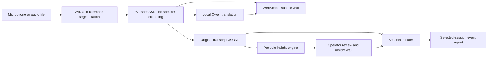

# Forum Agent: assessment and translation integration plan

Assessed locally on 2026-09-14, source commit `8c3168c`. This assessment is based on the checked-out implementation, README, operator guide, tests, and historical stress results. It does not assess the separate translation application, whose source has not yet been supplied.

## What the product does

Forum Agent is a local meeting assistant for an operator and a moderator. It listens to one room, displays bilingual subtitles, periodically extracts discussion points, and drafts written outputs. The word “agent” here primarily means an automated processing pipeline; it is not a meeting bot that joins a call or autonomously participates in discussion.

| When | Output | Who uses it |
| --- | --- | --- |
| During speech | Chinese/English transcript and translated subtitles, with anonymous speaker labels | Attendees, on the subtitle wall |
| About every three minutes | Key points, consensus, tensions, open questions, and next steps | Moderator and attendees, on the insight wall |
| During review | Approve, edit, hide, and view approved points so far | Operator and moderator |
| On stopping a running session | Draft minutes for that session | Meeting organizer |
| On request after sessions | Draft report combining selected sessions | Event organizer |

Insights carry transcript quotes and a grounding check. That check establishes that a quoted string appears in the transcript; it does not prove that the model's interpretation or inferred consensus is correct. Live auto-approval is enabled by default for grounded items; operators can switch it off. All generated outputs require human review.

## Implementation map



| Component | Files and behavior |
| --- | --- |
| Web UI/API | `forum_agent/server.py`, `forum_agent/static/`; FastAPI on loopback port 8710, plain HTML/JavaScript, room WebSocket feed |
| Session lifecycle | `forum_agent/session.py`; one global session manager, archiving and automatic minutes |
| Audio capture/replay | `forum_agent/replay.py`, `segmenter.py`, `vad.py`; 16 kHz mono processing, microphone device selection and audio-file ingestion |
| Speech recognition | `forum_agent/asr.py`; MLX Whisper large-v3-turbo |
| Speaker labels | `forum_agent/diarize.py`; ECAPA embeddings with online clustering, labels Speaker A/B/etc., up to 24 clusters |
| Translation | `forum_agent/translate.py`; English → Simplified Chinese, Chinese/mixed → English; asynchronous per-segment translation |
| Local inference | `forum_agent/llm.py`, `constants.py`; managed MLX model server on port 8711; Qwen3 8B for translation/insights, Qwen2.5 32B for minutes/reports |
| Synthesis | `forum_agent/insights.py`, `report.py`, `prompts/`; transcript-driven insights, minutes, and reports |
| Storage | Local `data/` files, including JSONL transcripts/translations, Markdown drafts, audio and session archives; no database |

The browser is a viewer/controller. Closing a browser does not stop the server or a recording. Microphone input is captured by Python on the Mac, not by browser audio APIs.

## Fit with the live translation application

Recommended boundary: let the translation application own meeting audio capture, recognition, speaker identity mapping, and translation, then send finalized source transcript segments and their translations to Forum Agent. Reuse Forum Agent's review workflow, insight engine, minutes, and reports.

There is currently no implemented external transcript ingestion API, meeting-joining connector, or continuous network-audio ingress. `/api/ingest` is a recording upload endpoint. `/ws/room/{room}` broadcasts results to viewers; incoming text is treated as keepalive, not as transcript input. Room-labelled URLs do not provide independent concurrent meeting sessions: the manager is a singleton and several report paths assume `room1`.

Three possible scopes:

1. **Translate existing Forum Agent transcripts.** Replace the call behind `translate.translate(text, lang)` with an adapter to the existing translation service. Keep Whisper and diarization. Lowest code impact if the other app only translates text.
2. **Feed the existing app's transcript and translations.** Add an external session source plus validated ingestion endpoints. Factor the transcript persistence/broadcast logic out of `Pipeline.on_final` so both native audio and external text use it. This is the preferred option if the translation application already performs ASR.
3. **Route meeting audio into the microphone path.** Select a virtual audio input carrying meeting audio. This can demonstrate the system without a meeting SDK, but duplicates ASR/translation if the other app already runs them and may lose per-participant speaker metadata. No virtual audio routing was configured during this assessment.

Proposed external segment contract (design only, not an existing endpoint):

```json
{
  "session_id": "external-stable-meeting-id",
  "room": "room1",
  "segment_id": "stable-utterance-id",
  "revision": 1,
  "final": true,
  "t_start": 12.5,
  "t_end": 17.0,
  "speaker_id": "Speaker A",
  "lang": "en",
  "text": "We should compare the two options before deciding.",
  "translation": "我们应该先比较这两个选项，再做决定。"
}
```

The adapter needs idempotent segment IDs, ordering, reconnect/resume behavior, session start/stop, partial-vs-final rules, and explicit translation revisions. The current transcript rows omit persistent segment IDs; translations use sequential IDs and are associated by order, so simply appending external JSON without lifecycle coordination is insufficient. Keep original-language source text for quote grounding. Map participant names to anonymous labels if that remains an event requirement. If the integration crosses machines, add authentication, TLS, and exact origin/host validation before exposing the local service.

## Readiness and limitations

- The repository presents itself as event-ready for one room. That claim is not a substitute for a rehearsal on the intended machine and meeting feed.
- Historical stress results in `stress/RESULTS.md` include noisy/overlapping speech failures and weaker performance on a 16 GB Mac. Some reported defects are already fixed in this checkout, including sequential Silero inference, the 24-speaker cap, and the LLM watchdog. Do not treat every historical finding as an outstanding bug.
- Speaker clustering labels are approximate and are not source separation for simultaneous speakers. Translation-app participant metadata could improve this boundary considerably.
- Translation and ASR have separate queues; this lets subtitles continue when translation is slow, but there is no bounded translation queue or external backpressure contract. Sustained overload can build a backlog.
- The live insight context is a rolling 15-minute transcript window. Test whether the accumulated approved points and minutes prompts preserve the information required for longer forums.
- The 32B model adds substantial disk and memory requirements. This Mac has 48 GiB RAM, below the project's 64 GiB recommendation. It initially had about 43 GiB disk available. The app skips report-model preloading on this machine, but requesting minutes/reports can still download and load it.
- Anonymous speaker labels do not remove spoken names from transcript text or voices from recordings. The names check is advisory. Cloud polish is a separate, optional text-upload feature; it was not used for this assessment.
- The HTTP/WebSocket origin guard uses prefix matching, which would also match a hostname such as `http://localhost.example.com`. Exact parsed-origin and Host validation should be addressed before relying on that guard for broader integration. The service currently binds to loopback.
- Apache-2.0 licensing permits modification and integration subject to the license terms; model licenses and any meeting-platform obligations are separate review items.

## Local operation

Open the operator console at <http://127.0.0.1:8710/control>, subtitles at <http://127.0.0.1:8710/subtitles>, and insights at <http://127.0.0.1:8710/insights>. The repository's `Forum Agent.command` launcher uses `.venv/bin/python` and can be double-clicked for future runs.

The generated test fixture is synthetic Chinese/English speech with 71 utterances, approximately 9.7 minutes. Use **Start test audio file** to replay it, **Summarize now** to request insights sooner, and **Stop** to archive a running session and trigger minutes. No real microphone recording or cloud polish is needed for this demo.

Local verification completed:

- Installed the exact `requirements.txt` dependencies in `.venv` using standalone Python 3.12.11. The initially selected Anaconda Python encountered an incompatible MPI library and the model server aborted. An initial cold launch also exceeded the app's 30-second startup deadline; after warming imports, the local model server and web server started successfully. See the [MLX distributed-runtime documentation](https://github.com/ml-explore/mlx/blob/main/docs/src/usage/distributed.rst) for the underlying MPI dependency context.
- All **66 repository tests passed** in the final environment (12.99 seconds; four deprecation warnings). These are unit/route checks, not a full accuracy or performance acceptance run.
- Downloaded and exercised Whisper, ECAPA speaker embeddings, and the Qwen3 8B live model. The synthetic replay is real inference, not seeded screenshots or mocked outputs. Audio playback is muted for the automated demo; no microphone capture was started.
- At the saved checkpoint: **25 transcript segments, 24 translated segments, 4 speaker labels**. Both source-language subtitles and translations were visually verified in the browser.
- Final-segment lag from the app's rounded log values: **mean 2.97 s, maximum 5.5 s** in this partial replay. Some delays exceeded the project's <3-second goal during insight generation. These measurements exclude partial-subtitle and translation completion latency, and do not establish a full-session percentile or accuracy result.
- A manual insight request returned generated items, and the bilingual insight wall visibly displayed key points, emerging consensus, tensions, and open questions. The generation took more than the UI's advertised 30–60 seconds on this run.
- Manual generation overlapped the automatic three-minute refresh: the status API showed two simultaneous insight jobs. A generation lock/coalescing policy is worth adding before integration; overlap consumes inference capacity and may replace newer summaries with older results.
- No full 9.7-minute acceptance suite, real microphone/meeting capture, minutes generation, cross-session report generation, or offline reboot validation was completed. The separate 32B report/minutes model was not downloaded for this smoke test.
- Raw local evidence is in `data/server.log`, `data/llm-server.log`, `data/tests.log`, `data/insight-smoke.json`, and `data/local-smoke-results.json`. The app and muted test replay were left running for exploration; the replay is finite, while the web server stays available.
- Application source and model settings were not changed. This assessment is the only tracked-file addition.
