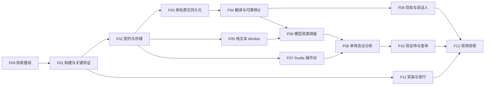

# Vision Forum 实施任务、依赖与验收

版本：v1.5，2026-09-16。配套：[工程主方案](VISION_FORUM_ENGINEERING_PLAN_ZH.md)、[数据与协议](DATA_AND_PROTOCOL_ZH.md)、[实施进度与验证](PROGRESS_ZH.md)。按顺序分为四部分：① F00–F01 整合基础；② F02–F04 可靠字幕；③ F05–F08 单场论坛；④ F09–F12 完整 Forum。具体状态在每个任务标题下更新，设计文档或局部测试通过不等于整个阶段通过。

## 1. 执行约定

- 全部产品工作先在 `codex/vision-forum-integration` 分支推进。保留已有未提交修改；实施开始时区分演示修复、设计文档、源码导入和新功能，分别形成可审查提交。
- 每个 F 任务可拆成数个小提交/PR，但交付应能独立运行其验证。不得一次提交整个桌面壳、数据库、worker、模型切换与 UI 重写而无阶段证据。
- Hen 源码只从已记录的固定 commit 受控导入，后续在 Forum 分支修改；原 Hen 仓库不作为同时写入目标。许可证、来源 commit、原文件映射随导入提交。
- 不把真实录音、字幕截图、个人配置、签名凭据和模型权重提交到仓库。验收数据使用本地清单引用；仓库内保存合成/明确可分发的 fixtures 和不含原文的指标。
- 每项完成更新本文件的状态和实际证据路径；出现协议/范围变化先更新配套设计。测试失败时先修对应行为，不通过改低门槛使其“通过”。

## 2. 依赖图与阶段出口



F11 的构建脚手架在 F01 就启动；正式包在 F08–F10 功能完成后反复验证。F07 可以先用标明 preview 的合成数据开发布局，但只有接入真实 core 后才能通过。

| 出口 | 条件 | 对用户可展示的成果 |
|---|---|---|
| M0：可靠字幕 | F00–F04 通过 | 真实音频、双语字幕、持续原文与译文、停止后最后一句存在 |
| M1：单场论坛 | F05–F08 通过 | 统一操作台、审核洞察、会议库、纪要与可恢复任务 |
| M2：完整活动 | F09–F10 通过 | 双轨/匿名标签、双会场、跨场摘要、参会者查询和闭幕综述 |
| M3：Forum 完成 | F11–F12 通过；需求偏离全部有记录 | 安装包、离线准备、两次排练、C1–C10 证据和操作手册 |

## 3. 任务明细

### F00 — 固定基线、产品配置和验收口径

依赖：无。状态：已完成（配置与验收基线；产品验收尚未执行）。证据：[ADR 0003](../adr/0003-forum-integration-baseline.md)、[配置](acceptance-profile.json)、`scripts/validate_forum_profile.py`。

修改/新增：`docs/engineering/acceptance-profile.json`、`profiles/ai-vision-forum/` 初始配置、`docs/adr/` 决策记录、来源清单；以上已经落地。

工作：

1. 记录两仓库完整 commit、工作区现有修改、实际工具链与机器信息；锁定复制清单。
2. 把 C1–C10 对应到本任务表；确定会场输入为 mixer/麦克风、两场各一机，以及正式测试的音频长度/声学条件。
3. 明确 `<3s` 的口径：原 SPEC 没有写分位数；本方案的 p95 候选不能自动代替它。记录是否要求逐句 max <3s、允许的异常样本及降级表现；未明确则不声称原指标已通过。
4. 固定公开字幕策略和脱敏审核边界；同时记录内部译文延迟和人工发布延迟。Forum 正式 C3 测试必须全程开启录音；用户关闭录音仍可使用，但该次不满足完整录音条件。
5. 固定 C6 停止到可用纪要草稿的时限，包含队列等待；初始候选为 90 分钟会议停止后 180 秒内出完整草稿，需按硬件/语言实测修订并记录理由。
6. 固定 Forum 应用身份与无商业登录的活动模式；把品牌、匿名策略、模板放 profile，构建身份独立配置。

通过：每项需求有测试场景、指标、目标硬件和失败条件；未决产品约束明确列出，而非藏在实现默认值中。此任务不启动真实录音或上传任何材料。

### F01 — 源码导入与高风险技术验证

依赖：F00。状态：进行中。受控导入、基础桌面适配、模型文件 probe、worker 协议测试已完成；本机隔离、并发/取消、语种对照和独立 Python/MLX 打包已有证据；第二台 Mac、原 Translator 应用人工共存和手机 LAN 信任仍待实测。详见[实际进度](PROGRESS_ZH.md)。

修改/新增：`desktop/` 的 Hen workspace 基线、`desktop/forum-shell/`、锁文件、构建/资源脚本、`.gitignore`、`THIRD_PARTY_NOTICES.md`；`services/meeting-worker/` 最小握手程序。

工作：

1. 复制必要源码，更新 workspace、shell 名称、路径、bundle identity、资源和脚本；不导入 Qwen TTS 实验/voice lab、账户凭据或生产账号依赖。
2. 先重现现有 ASR/翻译能力，记录导入前后同音频结果；导入阶段不同时替换模型。
3. 验证 Qwen ASR 绑定对 auto/mixed language 的支持，建立中文、英文、句内混说和交替发言集；若不满足，明确 Whisper 可选 adapter 的工程成本与测试结果。
4. 验证 Rust 实时推理与 Python 8B 摘要同时运行、取消推理、释放统一内存；识别不支持合作取消的调用。记录进程终止与后续重启时间。
5. 验证 Dora coordinator/daemon 的实例隔离。修改宽泛 stale flow 清理；在 Translator 正常运行时打开/关闭 Forum，不得停止其 flow。
6. 构建最小 .app：无开发环境机器上启动 Rust + Python worker + 一个实际 MLX 请求；验证原生动态库/Metal 资源路径。固定可分发 Python 方案。
7. 用两设备验证 LAN peer TLS 身份、手机 HTTPS/二维码访问方案的可行性。此处可用无内容的最小服务，不公开当前旧控制台。

通过：固定语言模式/后端、并发策略、Python 打包、Dora 隔离和 LAN 信任部署的 ADR。高风险项没有通过时，不能先花大量工作重做全部 UI。2026-09-16 用户随后明确授权：第一部分暂时无法测试，先开始第二部分开发。因此 F01 跨设备及人工共存验收延期，F02–F04 开始；未验证项仍不标为通过，第二部分完成后仍须用户确认才能进入第三部分。随后用户以“Git push, then start part 3”明确授权；已推送第二部分并实施第三部分。用户随后以“start part 4”授权第四部分，F09–F12 开始；外机和正式产品验收仍单独保留。

### F02 — 协议、SQLite 与会议状态机

依赖：F01 的构建基线。状态：代码与桌面集成完成，本机核心测试通过；完整 M0 文件回放通过（F01 外机验收延期）。单写 actor、完整状态机、版本 4 迁移、同源契约、分页/导出均已落地，详见 F02_F04_LOCAL_VALIDATION_ZH.md。

修改/新增：`desktop/crates/forum-contracts/`、`forum-core/src/{session,store,event,snapshot}.rs`、`forum-core/migrations/`、`packages/contracts/`、无模型测试。

工作：实现 UUID/session/track 层级、事件 envelope、partial 与 revision 区分、UTF-8 spans、单写 actor、事务/outbox、FK/迁移、会议状态。生成 TS/JSON schema，Python 校验同一版本。引入稳定分页和一致 snapshot cursor。

通过：重复事件只保存一次；正文冲突被拒；事务中途崩溃不留下半条记录；跨 session 引用失败；修订版本保留；快照与增量恢复无缺口；应用重启仍可读。此阶段用合成事件，不加载模型。

### F03 — 采音、ASR 旁路保存与录音恢复

依赖：F02。状态：采音/录音/ASR/恢复生产路径已接；真实无 Translator 的文件探针通过，完整桌面文件回放通过；真实设备/长会性能待验收。

修改：`desktop/moxin-dora-bridge/src/widgets/aec_input.rs`、ASR `src/main.rs`、`dispatcher.rs`、数据流 YAML；新增 `forum-core/src/ingest.rs`、`forum-runtime/src/{capture,recording,dora_sink}.rs`。

工作：采集时创建稳定段 ID/采样时钟，在分派 final ASR 前持久登记预期闭合段；ASR 透传完整元数据；订阅 ASR final 并在翻译之前持久化；producer outbox/ack/重发；旧 partial 可合并、final 不丢；音频分片、manifest、gap 与停止 seal；回放走同一路径。

通过：关闭翻译 node 仍有完整原文；强制结束 core 后从 outbox/录音恢复；ASR 出队后、final 前崩溃也能从 capture 清单发现遗漏；设备拔出记录 gap；不把 ASR failed 当作空白；音频回调不会等 SQL/模型；录音关闭时准确说明恢复限制。

### F04 — 翻译关联、自动双语与可靠停止

依赖：F03，F01 的语言后端决策。状态：翻译关联、自动双目标、语向边界、恢复与可靠停止已接；完整 M0 文件回放通过；混说仍有术语/指代偏差，正式语言质量/时延/设备门槛尚未通过。

修改：translator `transcript_buffer.rs/main.rs/backend_mlx.rs`、`data.rs`、`translation_listener.rs`；新增 `forum-core/src/translation.rs`、`forum-runtime/src/shutdown.rs`。

工作：带来源 spans 的缓冲与 commit；translation ID/revision/attempt；方向 epoch 与 configured/detected language 分离；中英/混说路由；把 UI history 改为 core 投影。ASR final 提交时创建持久翻译 coverage，停止 flush 或重启时补齐未 commit 的尾部任务。Stop 等待实际 capture release、producer seal 和预期原文逐段 durable ack，尾部译文可继续排队；不以 queue.empty 判定完成。

通过：多段合译、单段拆译、emoji/组合字、标点/trim 映射正确；迟到译文不串句；切方向旧结果不过写；翻译出队但仍生成时 Stop 最后一句不消失；短于 10 字/无标点且未 commit 时停止或崩溃，重启后仍能恢复译文；Stop 后新 session 正常启动；自动双语通过 F00 样本门槛。产出 M0 演示。

### F05 — 无状态会议 Worker 与证据验证

依赖：F02；可与 F03/F04 并行。状态：工程完成；真实 8B 及宿主/core 链路通过，结构与引用校验、进程/协议故障测试通过。语义质量仍待正式验收。见 [本机记录](F05_F08_LOCAL_VALIDATION_ZH.md)。

修改/新增：`services/meeting-worker/`、版本化 prompts、`forum-runtime/src/worker.rs`、`forum-core/src/{job,artifact,evidence}.rs`。

工作：从 Forum 抽取分析纯函数；JSON-RPC/NDJSON 握手、文件快照、hash、总预算、cancel/ping；禁止导入原 server/session 全局入口。结构化输出带引用、模型/提示词版本；core 校验 UTF-8 引文和来源 revision。

通过：无模型 fake worker 覆盖超时、崩溃、非法 JSON、超长行、路径越界、旧 attempt；A 任务不写 B/C 场；验证后、提交前发生取消/来源修订时，事务围栏拒绝旧结果；缺失引文不能默认 grounded；空审核集合不回退 draft。真实 8B 请求证明调用链可用，不据一次输出判定质量。

### F06 — 持久任务队列与资源调度

依赖：F04、F05。状态：持久队列、单后台/实时优先、取消/进程组收尾、含排队 deadline、跨快照确认缓存和退出持久 intent 已实现；正式并发时延、长会和真实 32B 验收待完成。

新增：`forum-core/src/{scheduler,job_steps}.rs`、`forum-runtime/src/{models,resource_budget,supervisor}.rs`、模型 manifest、指标聚合。

工作：实时优先、后台单任务、洞察请求合并、总 deadline/有限重试、分块 checkpoint、取消和实际进程退出确认；新会话中断旧 batch；32B 只在许可的会后模式加载；后台等待原因与进度上报。partial 草稿对应明确的 `succeeded_partial` 终态，重试增加 attempt；checkpoint 校验输入和完整配置 hash。所有进程清理验证 ownership。

通过：摘要并发时实时指标不过 F00 门槛；32B 工作中开始新会话，旧计算被限时收回且能恢复未完成块；模型异常不停止录音/破坏数据；无全局 pkill/端口占用者清理；重复任务/结果不重复入库。

### F07 — Svelte 操作台、浮窗与同机大屏

依赖：F02，可先开发纯组件；最终通过依赖 F04/F06。状态：Svelte 工作区、真实 core commands 和 loopback 只读大屏已接；前端 19 项测试及构建通过，公开撤回/授权过期 socket 测试通过；真实麦克风和外机体验待验收。

修改：导入的 `App.svelte`、`Overlay.svelte`、`lib/api.ts`；新增 pages/components/transport/stores、Tauri commands、`forum-gateway` 的 loopback 只读模式。

工作：会前设置、实时控制、双语浮窗、洞察审核、引用定位、任务状态、历史入口；统一 ForumClient；拆 DesktopTransport/DisplayTransport。快照+cursor 恢复；分页/虚拟列表；明确 preview 和真实模式；主窗口隐藏与应用退出行为。

通过：真实麦克风字幕显示；翻译故障/摘要暂停能分辨；大屏刷新恢复同一场次；draft/hidden 不进入公共 payload；脚本/HTML 样式的模型内容按文本渲染；长列表不卡住控制；关闭窗口不丢录音，退出能释放设备。

### F08 — 会议库、洞察审核、完整纪要与报告

依赖：F05–F07。状态：会中洞察、完整输入分块/尾段、纪要、所选已发布报告、编辑审核、失效传播、导出和旧记录导入已实现；真实 8B 合成全文链路通过。真实会议盲评和 90 分钟/180 秒 C6 尚未通过。

新增/修改：worker `tasks/{insights,minutes,report,questions,redact,closing}.py`；core `review/publication/export/import`；UI 会议明细、纪要与报告页面。

工作：3–5 分钟洞察；明确 draft/validation/review/publication 状态；人工编辑新版本；引用修订/撤回失效传播。全场 token 分块、coverage、会中可复用的已完成分块、会后快速汇总；活动报告明确选场；Markdown/HTML/JSON 导出、可打印样式；旧 JSONL 只读导入。

通过：结论类型、数字/否定、行动项归属盲评；纪要包含长会议最后一段决策；手动确认不被自动刷新覆盖；报告不混入未选场次、hidden/draft；修订源文后引用和公开结果失效；C6 时限包含排队，超过即报告未通过。离线批处理备份机器/更小模型如需引入，补架构验证，不能用“已入队”替代即时纪要。

### F09 — 双轨会议音频与匿名说话人

依赖：F04/F06，F01 的声学/资源验证。状态：双轨、参考回声处理、独立声纹 worker/core/桌面接入已实现；短合成双轨真实 ASR/翻译及 ECAPA 宿主链路通过。真实声学/多人准确率/长会漂移待验收，详见 [第四部分本机记录](F09_F12_LOCAL_VALIDATION_ZH.md)。

修改：CPAL/ScreenCaptureKit 采集、VAD 状态、ASR 公平队列；新增 `services/speaker-worker/`、speaker assignment 存储/修订、双轨录音回放。

工作：mic/system 独立 track/VAD，统一时钟、漂移校正、AEC 与录音映射；一个 ASR worker 按 track 调度，先评测后决定是否增加实例。ECAPA 异步标签、unknown/overlap、匿名标签人工修订；不跨 session 猜测同一身份。

通过：耳机/扬声器、远端+本地同时说话、蓝牙切换、设备拔出/权限拒绝、90 分钟漂移；重复音频不大量重复转写，真实重复表达不被误删；说话人错误有量化指标，重叠不强行分给单人。C3 正式测试全程启用录音并能定位回放。

### F10 — 双会场、跨场摘要、二维码与闭幕综述

依赖：F08，F01 的 LAN 可行性验证；F09 可并行。状态：TLS 配对、公开投影/撤回/stale、查询/二维码、精确版本跨场报告与闭幕朗读已实现；两个临时数据库和真实 TLS 本机测试通过；物理双机和手机信任部署待验收。

新增：`forum-gateway` 的 LAN/read-only/peer modes、配对与权限、发布同步、公开 evidence 投影、查询索引；UI 活动总览、跨场视图、参会者页面、闭幕模式。

工作：一场一机独立 owner；发布游标/快照同步、撤回传播、断线 stale；只同步已发布脱敏资料。公开引用、搜索摘要/高亮和 QR 页面使用公开证据副本，不能夹带内部原文。C8 主持人问题私有；C9 只读浏览/检索；C10 从选择的发布版本综合并经审核后展示/朗读。

通过：两机断网各自继续；重连重复/乱序/缺口恢复；对方隐藏内容在本地撤回；手机实际证书/网络/二维码可用；只读凭证无法控制录音或读取音频；过期/revoke 生效；闭幕朗读停止有效且不会再次进入 ASR。撤回对离线设备只能在重连后生效，界面需显示最后同步时间。

### F11 — 正式安装、模型准备、更新与操作手册

依赖：脚手架依赖 F01；最终完成依赖 F08–F10。状态：三类模型进程随包运行、离线依赖锁、开发/发行门禁、完整性检查和 DMG 脚本已实现；开发包构建验证记录见 [发行说明](PACKAGING_RELEASE_ZH.md)。正式签名、公证、干净 Mac 和更新验收待完成。

修改：Tauri 配置/capabilities/Info.plist、Python/Dora/Metal sidecar 打包、模型下载器、CI、更新签名、`README.md`、`docs/OPERATOR_GUIDE.md`、`docs/DATA_HANDLING.md`。

工作：构建可重现 arm64 .app/DMG；固定所有运行依赖和模型 manifest；会前离线准备/校验、安装失败恢复、模型缓存安装锁。明确 Forum 身份/存储/更新 feed，不引用 Translator 更新。正式签名/公证资料由发布方提供并只在发布环境使用；用户无需开发工具。

通过：干净 Mac 安装、首次准备后断网全流程；权限归属正确；Translator/Forum 共存；异常退出可恢复；升级不在会议中重启；错签名/错产品更新被拒。无证书时可提供清楚标识的开发包，但不能标记正式发行验收通过。

### F12 — 两次排练、回归与 Forum 完成标记

依赖：F09–F11；全部需求映射通过。状态：无模型回归、短合成真实双轨/声纹探针及 [两次排练脚本与记录表](FORUM_REHEARSAL_ZH.md) 已落地。90 分钟两机受控回放与真实会议排练未执行，C1–C10 正式门槛未标通过；不能标记稳定 Forum release。

工作：按固定脚本运行一次受控回放排练和一次受控真实会议排练；两台目标机器并行；穿插断网、投屏刷新、设备异常、模型故障、切会、停止、重启、长报告。生成不含私密原文的指标与覆盖记录。

通过：无未解决的会话串写、稳定原文丢失、公开草稿泄漏、无法停麦或误停其他应用问题；C1/C3/C6 等硬指标按 F00 口径逐项报告。每个 C1–C10 有证据、限制和操作员恢复步骤。标记稳定 Forum release，之后才开始独立 Minutes 的派生设计和仓库建立。

## 4. 测试层次与目标

| 层次 | 测什么 | 执行位置 |
|---|---|---|
| 无模型单元/契约 | ID、状态机、spans、审核、事件幂等、协议错误 | 普通 CI；不下载模型 |
| 无模型集成 | fake Dora/worker、SQLite 事务/outbox、停止和重启、snapshot replay | CI 或开发机临时目录 |
| 模型质量/性能 | 同音频 ASR/翻译/洞察、语义与匿名质量、并发和取消 | 固定 Apple Silicon 机器，手动触发 |
| UI/桌面 | 控制、真实事件、投影重连、权限、退出 | 浏览器组件测试 + 实际 Tauri/macOS 验证 |
| 现场/发行 | 两机网络、长会议、手机入口、安装/公证、离线 | 目标硬件与现场网络 |

现有 `tests/test_grounding.py`、`test_insight_actions.py`、`test_report_selection.py` 等可迁移业务用例；`test_stale_refresh_redirects_to_archive` 的旧期望应改成固定原 session。旧 `acceptance_m1.py` 的全局无重叠检查不能用于双轨，要按 track 检查时序。旧 suite 继续保证旧应用未意外损坏，不用它宣称新产品已通过。

候选指标需在 F00 固定口径，F01 测试后记录实际可承诺值：

| 项目 | 初始验收目标 |
|---|---|
| 稳定事件 | 所有已 ack 的 final 在重启后存在；重复消息不产生重复句子 |
| 字幕延迟 | 报告首字、句末原文、句末译文 p50/p95/p99/max；候选最终译文 p95 ≤3 秒，原 SPEC 的逐句要求另明确 |
| 洞察并发 | 开启后台后仍满足正式实时门槛；不能只比较相对慢多少 |
| 停止采样 | 操作后 ≤1 秒反馈采样已停；进程/驱动实际释放另测并记录 |
| 纪要 | 候选 90 分钟会议停止到完整草稿 ≤180 秒，包含排队；不能用 partial 冒充 |
| 报告 | 选择的所有场次覆盖；在活动结束后 24 小时内形成可审核初稿 |
| 引用 | 公开产物 100% 引用能定位到当前有效的公开证据；引用有效不代替语义盲评 |
| 可靠性 | 两机各 90 分钟连续运行，无无法解释的音频 gap；故障注入的缺口必须被记录 |
| 重连 | 短时断网后可恢复到相同发布投影；不重复/不复活撤回版本 |
| 安装与离线 | 无开发环境机器可用；准备完成后无互联网仍完成 C1–C10 的本地/局域网流程 |

质量集覆盖中文/英文/混说、术语、数字、否定、长句、多人抢话、静音与噪音；WER/CER 和译文人工评分分别记录。除引用结构等确定性约束外，不在没有基线数据时编造“准确率 99%”。

## 5. 实施时的验证命令约定

以下是拟新增目录实现后的命令约定，目前不能直接用于尚未创建的工程。F01 固定真实工具链和锁文件后更新具体入口：

```bash
# 仓库根目录：旧应用回归
.venv/bin/pytest tests/

# desktop/：无模型核心测试；核心 crate 不应强制链接 MLX 或 Tauri
cargo test -p forum-contracts -p forum-core

# desktop/forum-shell/ui/：类型与构建
npm ci
npm run check
npm run build

# services/meeting-worker/：独立 Python 包，测试不加载模型
uv run --locked pytest tests/
```

协议生成/差异检查、UI 行为测试、真实音频评测、打包与离线验证在对应 F 任务新增脚本；脚本记录输入清单与机器信息，避免手工改不同参数比较。普通 CI 不默默下载几十 GB 模型，模型评测只在明确配置的机器上执行。

## 6. 首个实现周期的具体提交顺序

1. `docs: freeze forum integration scope and acceptance profile`：补齐 F00 未决项和来源基线。
2. `build: import pinned Hen desktop and runtime foundation`：纯导入与路径/身份调整，不夹带会议功能重写。
3. `test: verify bilingual runtime isolation and packaged worker`：记录 F01 spike，确定需要的适配器。
4. `feat: add versioned meeting events and local store`：F02 的无模型闭环。
5. `feat: persist stable ASR before translation`：F03。
6. `feat: preserve translation provenance and drain final speech`：F04；形成 M0。

后续按 F05–F12 推进。文档通过后实施从 F00/F01 开始，不先复制整套目录再补数据和生命周期设计。
