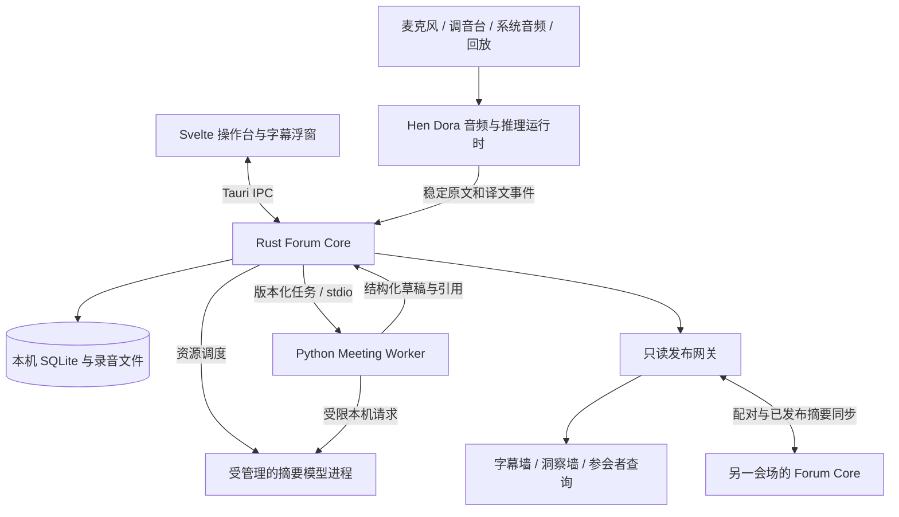

# AI Vision Forum 整合产品工程方案

版本：v1.1，2026-09-16。状态：已开始实施；F00 完成，F01 进行中，F02 部分完成。执行分支：`codex/vision-forum-integration`。实际交付与验证见[实施进度](PROGRESS_ZH.md)。

本轮用户决策：**先在当前 Forum Agent 仓库完成 AI Vision Forum 版，再从完成的产品派生独立 Hen Local Minutes。** 本文及配套协议、任务表是实施依据；之前评估中“立即新建 Minutes 仓库”的建议不再执行。用户已授权按任务顺序实施；源码现已受控导入，后续每个阶段以实际证据更新状态。

阅读顺序：本文说明产品、架构和实现决策；[数据与协议](DATA_AND_PROTOCOL_ZH.md)定义接口、数据库及一致性；[实施任务与验收](IMPLEMENTATION_TASKS_ZH.md)给出依赖顺序、文件修改和通过条件。架构章节描述目标状态；只有[实施进度](PROGRESS_ZH.md)列明的内容已经实现，不能从设计示例推定完整功能存在。

## 1. 交付目标与完成范围

交付一个可安装的 macOS Apple Silicon 应用：操作员选择会议与音源即可开始；现场看到真实中英字幕；主持人审核洞察；会后能查逐字稿、生成单场纪要和多场报告。软件负责模型检查、进程管理、存储、异常恢复，不要求操作员管理终端、Python 环境或多个模型服务。

以现有 [SPEC.md](../SPEC.md) 的 C1–C10 为最终 Forum 范围。第一个可用里程碑先完成单会场；双会场和原先的探索项继续在本分支完成，不能用单机演示替代最终交付。

| 需求 | 本轮目标 | 完成证据 |
|---|---|---|
| C1 实时中英字幕 | 中→英、英→中、中英混说；置顶字幕和大屏；故障状态明确 | 真实音频质量评测、各阶段延迟分位数、启用洞察的并发测试 |
| C2 双会场 | 每个会场一台 Mac 独立采集与存储；同一活动下两个 room | 两台机器同时运行 90 分钟；断网后各自继续，重连不串数据 |
| C3 录音及匿名逐字稿 | 可选原始录音、时间戳、匿名说话人、持续保存、原文修订 | 录音与片段可对齐；崩溃恢复；未知/重叠声音不伪造身份 |
| C4 实时洞察 | 要点、共识、分歧、问题、行动项；每 3–5 分钟尝试更新 | 每条结论有有效来源引用；未经审核不上公开洞察墙 |
| C5 跨会场摘要 | 交换已发布的结构化摘要，显示其他会场的进展 | 撤回与修订可传播；断线显示更新时间，不冒充实时 |
| C6 环节纪要 | 停止录音后自动排队生成草稿；可手动重试、编辑、审核 | 不阻塞下一场录音；引用、草稿版本和任务状态完整 |
| C7 综合报告 | 选择场次，分层综合，经人工审核导出 | 不静默截断长场次；所有选中场次有覆盖记录；24 小时内交付初稿 |
| C8 主持人问题建议 | 基于本场已确认原文和议题生成追问建议 | 主持人私有视图；不自动上墙或朗读 |
| C9 参会者查询 | 局域网二维码入口；浏览、检索已发布内容，附来源 | 手机连接实际会场网络可用；不能访问原始录音、逐字稿或控制接口 |
| C10 闭幕综述 | 跨场次综合简报、审核、现场展示和可选朗读 | 仅朗读审核版本；取消有效；音频不反灌转写 |

首版平台按 Hen 当前桌面基础设为 macOS 14+、Apple Silicon；最低可用内存和建议配置以实测发布矩阵确定。当前机器 48 GiB 只能作为一个测试档位，不能据此承诺 16 GiB 或任意 M 系列均满足全功能。多会场采用每场一机，暂不在同一台 Mac 同时运行两个音频推理栈。

本轮不包含 Windows/Linux 完整发行、Zoom/Teams/腾讯会议 bot、平台参会者身份接入、同声传译音轨回灌、商业订阅或云端推理。会议软件先通过本机系统音频接入。旧版可选云端润色不进入新的 Forum 发行默认功能；源码可保留在旧路径，不能被新应用隐式调用。

### 1.1 需要明确的两项需求边界

**实时不等于每个后续环节都有同一个 3 秒指标。** 分别测首个字幕、句末到稳定原文、句末到最终译文、公开发布延迟。C1 的候选工程目标是句末到最终译文 p95 ≤ 3 秒，仍需样本和硬件验证；原 SPEC 的 `<3s` 没有注明分位数，F00 必须明确验收是否要求逐句上限，不能自动用 p95 替代。人工审核等待时间单独报告，不计入模型耗时，也不能从现场展示延迟中隐去。

**匿名说话人不等于原文没有人名。** 现有 [DATA_HANDLING.md](../DATA_HANDLING.md)已说明这点。默认公共摘要只使用经人工审核和脱敏的发布版本。内部实时字幕保留原文供操作员检查；公开字幕必须选择已约定的发布策略：人工审核后展示可满足严格内容审核，自动遮蔽人名只能降低风险，不能保证发现所有身份线索。F00 先把活动采用的策略及延迟影响写入验收配置；这一冲突未明确前，不宣称同时满足“自动字幕 <3 秒”和“任何身份内容绝不公开”。

## 2. 已核对的源码基线与风险

| 来源 | 固定基线 | 用途 |
|---|---|---|
| Forum Agent | `8c3168c`，另有本地翻译演示开关修改 | 洞察、纪要、报告、人工审核与匿名说话人基础 |
| Hen Local Translator | `4904269`，应用 `1.2.0-beta.4` | Tauri/Svelte、Dora 音频链路、Qwen ASR/翻译、字幕浮窗、下载与分发基础 |

旧版运行文档中的性能数值属于其特定模型与机器，不能转用为新产品保证。Hen 原仓库在本轮保持不变；导入时记录完整 commit、许可证及模块清单。当前工作区已有演示模式等修改，应保留并单独归档，不能在导入时覆盖或当作已发布基线。

源码复核发现的优先修复点：

1. Hen 的字幕历史最终只保留原文和译文；局部 burst/commit 标识未贯穿存储，没有完整会议时间线。来源：`moxin-dora-bridge/src/data.rs`、`widgets/translation_listener.rs`、桌面 `src/app.rs`。
2. Hen ASR 当前后端返回文本，`source_language` 来自配置；现有固定翻译方向不等于自动识别语种或支持论坛混说。必须独立验证，见第 6 节。
3. Hen `controller.rs::stop_stale_hen_local_dataflows` 根据节点名称清理其他运行中的 flow。导入后必须改为实例归属清理，避免停止用户另开的 Translator。
4. Hen `TranslationRuntime::stop` 是异步命令，UI 清空不代表尾部 ASR/译文已完成；Forum `replay.py::_drain_and_close` 的队列空也不能代表正在执行的任务已完成。
5. Forum `insights.py` 的部分路径将草稿混入 approved log，且旧任务可能写入“最近归档”。新实现绑定原 session、快照和审核版本，禁止按最近场次回写。
6. Forum `minutes_for`/报告使用大模型，`llm.chat` 的单次 timeout 叠加多次重试不等于任务总时限。现场已出现 32B 纪要阻塞翻译。需要实际资源管理与可取消进程。
7. 现有 FastAPI 页面面向本机，WebSocket 主要用于输出。不能把 `/api/ingest` 音频上传当成外部文字入口，也不能直接开放原控制端口充当局域网只读投屏。

## 3. 架构决策

最终入口采用导入的 **Tauri 2 + Svelte 5 桌面应用**。Rust 核心拥有会议状态、持久化、音频运行时和子进程；Python 只执行会议分析任务。原 Python 应用在迁移期保留作行为对照，正式路径中不再启动它的麦克风管线和全局 session manager。



| 模块 | 唯一职责 | 不应承担 |
|---|---|---|
| `forum-core` | 会议状态、事件写入、版本、审核、任务队列、发布投影 | 音频回调内做 SQL；依赖 Tauri 窗口对象 |
| `forum-runtime` | Dora/模型/worker 生命周期、音源设备与资源准入 | 按进程名批量杀其他应用；自行覆盖会议数据 |
| `meeting-worker` | 从不可变输入生成洞察、纪要、报告等结构化结果 | 修改 SQLite、启动录音、自动下载模型、选“最近 session” |
| Svelte UI | 命令、状态展示、编辑与审核、字幕和大屏组件 | 将内存 history 当会议数据库；直接操作子进程 |
| `forum-gateway` | 只读发布投影、订阅恢复、配对后的跨场同步 | 暴露设备控制、账户、数据库、任意文件读取 |

第一阶段保留 Hen 的 Dora 运行时，保留 Forum 的 Python 提示词/分析逻辑。当前不同时重写音频、模型运行时和前端框架。共享的是明确接口与业务规则，不要求两个 MLX 实现自动合成一个推理实例。

### 3.1 拟新增目录

```text
forum-agent/
  forum_agent/                      # 现有 Python 应用，迁移期保留
  prompts/                          # 旧版提示词；新 worker 采用有版本的拷贝
  desktop/
    Cargo.toml / Cargo.lock         # 从 Hen 导入并锁定的应用 workspace
    rust-toolchain.toml             # F01 固定实际构建通过的工具链
    forum-shell/                   # 从 hen-local-translator-shell 导入
      src/{main,commands,state}.rs
      ui/src/
        pages/                     # Setup, Live, Library, Reports, Settings
        components/                # 字幕、洞察卡、引用、任务状态
        lib/{contracts,transport,stores}/
      tauri.conf.json / capabilities/
      dataflow/forum_translation.yml
    moxin-dora-bridge/              # 采集、dispatcher、listener；保留来源名称
    hen-local-init/                # 模型下载基础；去除写死的产品路径
    node-hub/{dora-qwen3-asr,dora-qwen35-translator}/
    crates/
      forum-contracts/             # Rust 类型；生成 schema/TS
      forum-core/                  # 状态机、存储、任务、审核、导入导出
      forum-runtime/               # 从原 shell/runtime.rs 抽取并扩展
      forum-gateway/               # HTTP/WS 发布与 peer 传输
    scripts/                       # 从 Hen 选择导入并修正路径的开发/打包脚本
  services/
    meeting-worker/
      pyproject.toml / uv.lock
      src/forum_meeting_worker/
        {main,protocol,models,grounding}.py
        tasks/{insights,minutes,report,questions,redact,closing}.py
        prompts/                   # 版本化提示词，包内资源加载
    speaker-worker/                # 可选 ECAPA 独立依赖与协议
  packages/contracts/              # 生成的 JSON Schema / TypeScript，禁止手改
  profiles/ai-vision-forum/         # 文案、术语、模板、功能与发布策略
  models/manifest.json             # 仓库仅保存清单，不保存权重
  evals/{fixtures,scenarios}/       # 授权/合成测试与故障场景
  tests/                          # 现有 Python 测试保留
  docs/engineering/                # 本方案、协议、任务与后续 ADR
  THIRD_PARTY_NOTICES.md           # 导入模块、依赖、模型/资源归属
```

导入采用受控源码清单；不要整目录复制 `.git`、`target`、`node_modules`、模型、账号配置、真实录音或开发环境。保留 Cargo/npm 锁文件、必要资源和构建脚本。原 shell 改为 `forum-shell` 时同步 Cargo 包/二进制名称、workspace members、脚本、数据流模板和资源相对路径。迁移清单应允许追溯原文件路径和上游 commit。

### 3.2 基础技术选择

- Rust 使用 Tokio、Serde、现有 Dora 0.4；存储拟用 `rusqlite` bundled SQLite，单写入 actor；只读网关拟用 Axum。新增版本在 F01/F02 做依赖兼容验证后固定，不在设计稿猜最新版本。
- 前端沿用 Svelte 5、Vite、TypeScript；尽量不引入另一套 UI 框架。先拆分现有 `App.svelte`，再增加页面。
- Python meeting worker 使用独立 Python 3.12 环境和最小依赖。分析 worker 不依赖 Whisper/Torch/SpeechBrain；ECAPA 如保留，放入独立可选组件。
- 本机 worker 使用有版本的 JSON Lines over stdio；模型 HTTP 端口由 runtime 分配、只绑定 loopback。音频采样不走 JSON/HTTP，继续走现有原生数据流。
- 原程序使用的 8710/8711 不硬编码进新客户端；开发默认端口可保留，运行时向 UI 返回实际地址。不能因端口冲突而杀占用端口的未知进程。

## 4. 会议状态、录音与稳定存储

详细类型、表结构和接口见 [数据与协议](DATA_AND_PROTOCOL_ZH.md)。这里列出实现必须保持的约束。

`Event → Room → Session → Track → Segment/Revision` 是数据层级。每次会议创建 UUID；room 只是活动内的逻辑会场，不再作为唯一会话标识。原文在 ASR final 出口保存，翻译、声纹、洞察随后关联。任何窗口关闭、翻译失败或后台模型退出均不应删除原文。

会议状态：`created → preparing → recording → stopping → draining → completed`，异常终态为 `interrupted`。`completed` 表示停止录音并完成收尾，纪要生成是独立 job。`capture_stopped` 和 `transcript_sealed` 分开报告；尾部无法完成时记录缺口、可重试任务和 partial 状态，不显示“完整保存”。不提供第一版暂停再续录：需要暂歇时停止并新建 session，避免含糊的时间线。

音频回调只做采集与轻量入队；后台线程写录音和转写队列。首版录音建议采用 30 秒独立 WAV 分片及 manifest，收尾校验后原子改名；完整文件按需导出。录音可关闭，但 ASR 原文保存不能随录音选项关闭。若未录音，崩溃时尚未稳定转写的音频无法事后恢复，UI 和验收必须明确这一限制。

Forum 正式 C3 验收配置必须开启全程录音；关闭录音属于支持的降级使用，该次会议不能标记满足完整录音要求。

停止按以下顺序实现：禁止新采样 → seal 各 track 最终采样游标 → 提交尾部 ASR → 等待稳定原文写入确认 → 标记翻译任务完成或可重试 → 更新 session 收尾状态 → 排队纪要。停止采样应立即执行；持续存储故障也必须释放麦克风。收尾采用总 deadline，超时记录 interrupted/待恢复任务，不能无限等待 GPU。完整退出还需取消生成、结束所属子进程、回收 wake lock 和关闭发布端口。

对账基准必须来自采集侧持久登记的全部闭合音频段；否则 ASR 在产生 final 之前崩溃会漏掉整段。翻译也要保存各目标语言的源跨度覆盖记录，包括尚未达到长度/标点门槛而未 commit 的尾句。收尾逐段、逐范围核对，不能只检查已经创建的任务是否完成。具体协议见附件。

数据库位于应用数据目录，开启外键、WAL 和明确的持久化策略；正式写入拟采用 `synchronous=FULL`，以性能测试校准批量大小。写入事件、更新当前投影、创建 outbox 消息在同一事务内完成。前端仅收到提交后的 durable 事件。备份使用 SQLite backup API 或受控关闭/检查点流程，不能只复制正在运行的 `.sqlite` 文件。[SQLite WAL](https://sqlite.org/wal.html)、[外键说明](https://sqlite.org/foreignkeys.html)。

旧 `data/sessions` 通过显式只读导入生成新 ID，并记录原路径/来源摘要；原文件保留。不能启动时自动改写历史数据。没有精确译文对齐的旧数据应标注关联置信度或未对齐，不伪造时间范围和引用。

## 5. 音频与字幕的具体整合

### 5.1 三种音源逐步接入

1. **论坛主路径：调音台/USB 麦克风单输入。** 先复用 Hen CPAL、VAD、ASR、翻译及浮窗；为所有音频添加 session/track/segment 标识和采样时钟。回放走同一事件链路，便于确定性回归。
2. **会议软件接入：系统音频。** 复用 macOS ScreenCaptureKit，说明它是系统音频捕获，当前不保证只捕获某个指定会议应用。拒绝权限时给出准确恢复路径，不能假装已开始采集。
3. **自己 + 远端双轨。** 当前 Hen 是二选一；新增独立 track capture，记录共同 monotonic 时钟和各自采样时间，按设备时钟重采样/校正漂移。麦克风和远端音频分别保存，播放参考用于 AEC；去重不能把两位说话人重复表达当回声删除。

初版按 track 标注 `local`/`remote`/`room_mix`，这些是声源而非真实参会者身份。双轨和匿名声纹分别验收。不得把一份混音简单复制成两轨后宣称完成双轨。

### 5.2 必须改动的 Hen 文件

以下为上游相对路径，导入后统一位于 `desktop/`，原 shell 对应 `desktop/forum-shell/`。

| 源文件 | 修改目标 |
|---|---|
| `moxin-dora-bridge/src/widgets/aec_input.rs` | 采集时创建 segment ID；传时间和 track；区分配置语种与检测语种；seal 尾部 |
| `moxin-dora-bridge/src/widgets/screencapture_input.rs` | 系统音频时间基准、双轨入口、停止/权限事件 |
| `node-hub/dora-qwen3-asr/src/main.rs` 与 `backend/macos.rs` | ASR metadata 贯穿；旁路发送 final；验证 auto/mixed language 能力 |
| `node-hub/dora-qwen35-translator/src/transcript_buffer.rs` | 文本切分同时保存来源 spans；禁止仅拼接字符串丢来源 |
| `node-hub/dora-qwen35-translator/src/main.rs` | 输出 translation ID、revision、targets 和 source refs；支持取消及 seal/drain |
| `moxin-dora-bridge/src/data.rs`、`widgets/translation_listener.rs` | 历史变为 UI 投影；不丢 ID；final 交给 core 写盘 |
| `moxin-dora-bridge/src/controller.rs`、`dispatcher.rs` | 按实例拥有的 flow 管理；注册 ASR 持久化 listener；显式连接健康状态 |
| 原 `hen-local-translator-shell/src/runtime.rs` | 提取运行时；Stop 返回完成事件；不再通过全局环境污染其他会话 |
| 原 `.../dataflow/translation_qwen35.yml` | ASR → 持久化旁路与 translator 双路；保留 ack/outbox 与尾部收尾能力 |

数据流不能只在现有最后一个翻译 listener 处添加 SQLite，因为翻译失败时那里可能根本收不到稳定原文。先加 ASR 旁路持久化；更强可靠性用 producer outbox + 确认/重发补齐。`burst_id` 是临时值，`commit_id` 可能重启复用，均不能用作持久主键。

### 5.3 匿名说话人

优先隔离复用 Forum `diarize.py` 的 ECAPA 计算，输入稳定音频片段，输出匿名 cluster 和置信信息。由 core 管理 session 内 speaker ID/标签，模型进程不决定全局身份。说话人信息可以晚于字幕补齐；低置信、过短或重叠音频显示未知/多人，不能强行指派某人。

不同会场/不同场次的 Speaker A 不是同一人。重命名、合并匿名标签产生版本事件并使相关来源归属过期。用真实多人、插话、噪音和远场音频评测，不沿用合成 fixture 的“全对”结论。

声纹组件可单独安装/停用以支持降级使用；正式 Forum C3 验收需要启用并验证匿名说话人能力，不能仅用 mic/system 两个声源标签替代多人分离。

## 6. 模型方案与实时资源调度

| 任务 | 首轮候选与来源 | 决策办法 |
|---|---|---|
| ASR | Hen `mlx-community/Qwen3-ASR-1.7B-8bit` | 先跑真实中英/混说；若当前 Rust binding 无法可靠返回混说原文，接 Forum Whisper 适配器作为可选后端 |
| ASR 对照 | Forum `mlx-community/whisper-large-v3-turbo` | 同一音频、同一分段与指标比较，不双份常驻处理同一路声音 |
| 字幕翻译 | Hen `mlx-community/Qwen3.5-2B-MLX-4bit` | 默认候选；验证方向切换、术语、否定、数字和混说；8B 作质量对照 |
| 实时洞察/追问 | Forum `mlx-community/Qwen3-8B-4bit` | 保留质量基线；评测关闭长思考、限制输入输出后的并发；小模型仅在通过质量门槛后替换 |
| 纪要/报告 | 同一 8B 标准档；`Qwen2.5-32B-Instruct-4bit` 可选会后档 | 分层生成先保证证据和覆盖；32B 不默认下载或会中预加载 |
| 声纹 | `speechbrain/spkrec-ecapa-voxceleb` | 独立可选 worker，单独评测资源与聚类误差 |
| 朗读 | macOS `say` | 先复用已工作的路径；自然神经 TTS 不列为 C10 必需条件 |

模型型号来自现有源码配置；“候选”不是质量排序。Hen crate 名 `qwen3_5_35b_mlx` 不代表在加载 35B 权重。两种 MLX runtime 不自动共享显存、KV cache 或已加载模型。

语言协议分开保存 `configured_source_language`、可空的 `detected_language` 与 `target_languages`。论坛配置默认目标为中文/英文：纯中文生成英文，纯英文生成中文；混说片段先保留忠实原文，再生成需要的中文/英文显示版本。可以用本地文本语言识别辅助路由，但应有 mixed/unknown，不能靠字符串包含汉字就判断整段语义。若无法证明自动模式质量，先在操作台标明固定方向，并把自动双语设为未通过 C1 的缺口。

### 6.1 资源调度规则

- Rust runtime 统一授予模型加载/推理许可；实时 ASR 和翻译保留资源，后台 worker 不得自选模型、绕过准入或触发隐式下载。
- ASR 与翻译能否并行由实测决定；不使用会让一次长翻译锁死 ASR 的全局 GPU 互斥锁。后台任务每机最多一个，调度粒度是有上限的推理步骤。
- 会中禁止 32B 报告模型；8B 洞察有输入 token、输出 token 和总 deadline，队列积压/延迟超标即暂停后台。启动新会议先取消旧报告并确认所属生成进程实际退出、内存释放，再准入实时模型；UI 显示准备阶段原因。
- F01 必须验证取消机制：HTTP 断开不等于 GPU 已停止。不能合作取消的模型任务应终止专用进程并按快照重跑该步骤，不承诺从 token/KV 状态精确续算。不能杀实时翻译进程以取消纪要。
- 存储任务是必达任务；partial 可合并，稳定原文不可静默丢弃。ASR/翻译故障与摘要故障独立呈现，摘要失败不停止录音。
- `FORUM_AGENT_TRANSLATION_DEMO` 保留作旧版诊断，不成为产品模式。新 UI 提供“后台洞察暂停/恢复”，实际落实在持久任务和资源调度器。

### 6.2 模型清单与会前准备

每个模型包清单包含角色、仓库、固定 revision、格式/量化、运行时版本、文件路径/大小/SHA-256、许可证、模板/tokenizer 版本和最低测试配置。下载到临时位置，校验后原子切换；支持重试、断点与失败清理。体积不等于运行内存，不根据参数量直接估算余量。

预检依次覆盖权限、设备、电平、磁盘、模型完整性、运行时、中文/英文短音频和摘要小任务；结果区分阻塞项和可降级项。活动模式使用已准备好的离线模型，不在会议中补下载。正式发布记录在 48 GiB 机器及目标现场机器上的峰值内存、持续负载和延迟；无法满足单机实时洞察时，F01 就选择局域网专用计算节点或调整模型，不能把问题推到活动前。

## 7. Forum 会议能力如何抽取

| 原实现 | 新位置/处理 |
|---|---|
| `insights.py::_parse_json/_repair_json` | worker 的结构化解析；保留格式容错，严格验证字段与来源 |
| `insights.py::_is_grounded` | `grounding.py`；从全文子串匹配升级为 segment/revision/span 校验 |
| `InsightEngine.refresh` | worker 纯生成任务 + core 的版本、审核、发布逻辑；去掉全局引擎状态 |
| `minutes_for/generate_minutes` | 分块提取 → 汇总 → 引用与覆盖校验；由 scheduler 调用 |
| `report.py` | session 摘要 map + 活动 reduce；去除按字符静默截断和全局输出文件 |
| `redact.py` | 本地候选身份线索检查；输出建议，不直接篡改原文 |
| `sofar.py` | core 的已发布视图；查询页与闭幕综述共享 |
| `speak.py` | runtime 音频输出适配器，只消费审核后的固定版本 |
| `llm.py` | 拆成无进程副作用的 model client；生命周期与总重试预算交给 runtime |
| `session.py/server.py` | 原应用继续工作；新路径由 Rust 状态机和网关替代 |

worker 只处理提交时封存的文本快照：session ID、截止序号、每个片段的 revision、任务类型、模型和提示词版本。返回结果在最终写事务内重新检查 job attempt、取消状态、快照 hash 和来源版本，防验证与提交之间发生修订。新发言不会使历史窗口摘要自动失效，但已引用片段被修订时需要标记 stale；旧任务不能写到当前新会议。部分生成结果保存为内部草稿，job 标记 `succeeded_partial`，不能按完整成功发布；重试复用输入及有效配置摘要均匹配的已确认分块。

实时洞察默认读取最近 15 分钟原文，加上有来源的累计摘要和议程，约 3 分钟检查新内容是否足够。累计摘要不能无限递归替代原文；每条结论保留直接来源。引用“在原文中存在”只能证明引文匹配，不能证明“大家达成共识”；提示词和人工评测另查主体、否定、分歧、行动项归属及事实支持。没有负责人/时间的行动项必须留空。

纪要覆盖完整 session，不只读最近窗口。长会议先按 token 预算和时间段提取事实，再综合，记录已处理区间和遗漏/失败；可在会中资源允许时预计算已稳定的分块，停止后校验并复用。C6 候选门槛为 90 分钟会议停止后 180 秒内得到完整草稿，包含资源排队，在 F00/F01 冻结实际目标；如果连续下一场导致无法达标，需调整计算配置，不能把入队视为完成。事件报告只接收用户选择的场次/发布版本，不用 `approved_log or items` 回退草稿。若用户要把草稿作为内部素材，必须是独立的内部草稿任务，结果不可直接发布。

UI 区分草稿、已审核、已发布、隐藏和过期；底层将 validation、review、publication 分成三个状态维度，避免把“引用存在”当作“人工同意”。通过审核的版本不可被后台重新生成覆盖。编辑产生新 revision 并重新审核；原文修订使依赖结论 stale，撤回公开副本，直到新版本被确认。发布前在同一事务内再次检查审核和来源。详细规则见协议文档。

## 8. 前端页面与操作流程

| 页面/窗口 | 控件与状态 | 实现重点 |
|---|---|---|
| 会前设置 | 活动/会场/议程、音源、语言、录音、字幕发布策略、预检 | 设备未就绪不显示录音中；区分测试回放与真实输入 |
| 实时操作台 | 电平、原文/译文、匿名标签、洞察草稿、引用跳转、后台状态 | 原文/翻译/摘要分别显示工作或错误状态；停止有收尾进度 |
| 字幕浮窗 | 原文/译文、字号、透明度、固定位置、显示延迟状态 | 复用 `Overlay.svelte`，按 segment ID 更新而非数组末尾拼接 |
| 字幕墙 | 高对比双语、大字、最新内容、断连提示 | 纯展示组件；无设备和写入权限；遵守当前发布策略 |
| 洞察墙 | 分类摘要、场次、最后更新时间、已发布来源 | 不渲染草稿；撤回事件立即删除对应版本 |
| 历史资料库 | session 列表、搜索、逐字稿/译文、播放、修订、导出 | 分页读取数据库；关闭窗口或超过 10,000 句不丢记录 |
| 纪要与报告 | 选择来源、任务进度、草稿/审核/发布版本、覆盖检查 | 不同任务独立版本；失败可重试；导出显示模型/生成时间 |
| 活动总览 | 两会场在线状态、已发布摘要、跨场进展、闭幕综述 | 单机也可打开；区分未更新、断连、已撤回 |
| 参会者页面 | 扫码、浏览和检索已发布内容、引用 | v1 用发布资料检索；如以后增加自由问答，另设受控任务能力 |

新 `ForumClient` 是 UI 唯一数据入口：桌面用 Tauri IPC，浏览器用只读 HTTP/WS。`api.ts` 中现有的 Tauri 调用与 browser preview 假数据必须拆开。开发 fixture 只能在明确的 preview/test 模式出现，生产页面不得用样例冒充真实字幕。复用纯 `CaptionView`、`InsightCard`、`ConnectionStatus` 和类型，不把桌面账户/更新 API 打进投影页面。

所有列表用稳定 ID/revision 更新；snapshot 与增量订阅需一致，刷新/重连恢复同一场次，不只订阅未来消息。历史与现场原文采用分页/虚拟列表；外部显示不接收完整历史录音路径。设备权限、错误和长任务使用中文可理解的说明，底层 exception 留诊断日志。

## 9. 双会场、本地网络与公开发布

每台机器拥有独立 SQLite、音频和 room 数据，不把 SQLite 放网络盘。活动 ID、room ID 和设备 ID 配对后确定；同一 room 同时只允许一个采集 owner，故障替机应创建新的 device/session 并显式接续，不能两边同时覆盖同一 session。

早期大屏在同机浏览器打开，网关仅绑定 loopback。C2/C5/C9 阶段才启用受控局域网监听：区分操作员桌面、只读显示、只读参会者和已配对 peer 权限。精确校验 Origin/Host，不使用 `startswith(localhost)`；不把原 FastAPI 的全部路由暴露到 LAN。

跨场只同步版本化的已发布摘要/纪要、撤回记录和更新时间，不默认同步原文、音频或草稿。公共引文、检索摘要/高亮和 WebSocket 快照也必须读取独立的脱敏 evidence 投影，不能通过引用附带内部原文；准确原始 segment/revision/span 映射留在 core。每个来源设备拥有递增发布游标；重试按消息 ID 幂等，断线后以游标恢复，缺口过大重新取发布快照。收到撤回立即移除远端展示，并使依赖的跨场摘要/报告 stale。网络断开不影响各会场实时录音，跨场显示明确标为旧数据。

配对使用一次性代码/指纹确认，并记录受信设备；peer 用 TLS 与固定身份验证。手机只读页面需要实际可用的 HTTPS 证书/信任部署和会场网络；F10 在真实 iOS/Android 环境验证，不依赖“所有浏览器跳过证书警告”。二维码只携带有限时效、限定场次的只读访问凭证；不携带控制 token。凭证不要写日志或作为普通查询参数泄漏给外链。配对、证书及断网方案先在 F01 明确可行性，F10 完成交付。

跨会场综合只基于已发布材料，保留 `room + session + artifact revision` 引用。C9 首版采用关键词/全文搜索和“本场至今”浏览即可满足查询场景，不为扫码浏览引入额外大模型负载。自由问答、任意互联网访问或会议 bot 是后续扩展。

闭幕朗读默认在采集停止后执行，或使用已验证隔离的输出音路。会中朗读必须先通过 AEC/系统音频过滤测试，不能假定排除主应用进程就会排除外部 `say` 的音频，也不能为防回声无声丢弃同时发生的真人发言。

## 10. 打包、安装与进程管理

Forum 产品名拟为 `AI Vision Forum`，开发 bundle ID 拟为 `org.aivisionforum.agent`；F01 验证并固定。使用独立数据目录、Keychain service、URL scheme、updater feed 和签名配置，不能沿用 Translator 的产品身份。Forum 版默认无商业登录/许可证门槛；Hen 的账户代码不进入主运行依赖。未来 Minutes 再配置产品授权，不需要现在复制云端数据库。

Tauri 包含 Rust 二进制、Dora 所需可执行文件/资源、Python worker 与解释器/原生依赖、提示词和配置；模型权重由会前下载器管理，不进入源码仓库。Python 打包先在 F01 做最小可行验证，再选择固定独立解释器加资源目录，或经验证可用的冻结产物。不能假定把脚本列入 `externalBin` 就完成 MLX/Torch 打包。Tauri sidecar 对外部二进制及目标架构有明确约定，构建脚本应按其规则生成资源。[Tauri sidecar 文档](https://v2.tauri.app/develop/sidecar/)。

每个受管理进程记录 `instance_id / pid / 启动标识 / process group / job_id / 可执行文件摘要`。只清理自己创建且身份仍匹配的进程，防止 PID 复用；Dora 的 daemon/coordinator 也必须核实可独立配置端口/运行目录。若现有 Dora 不能同时隔离，F01 必须给出明确的独立运行时方案，不能继续使用全局 stale-flow 扫描。

关闭主窗口默认只隐藏窗口并保留明确的菜单栏录音标识；“退出应用”执行完整停止收尾。系统关机/崩溃后下次启动显示恢复清单，不能自动重新打开麦克风。worker 无响应先取消，限时退出后终止所属进程；模型、麦克风和网络状态都由 core 汇总。应用更新下载可在空闲执行，安装/重启只能在没有活动采集和未收尾数据时进行。

开发包、现场试用包、正式签名/公证发行包分别标注。正式 .app/DMG 需要验证嵌套二进制与动态库签名、macOS 权限、Gatekeeper、公证和更新签名；仓库里存在脚本不等于有证书或已通过发行验证。[Tauri macOS 签名说明](https://v2.tauri.app/distribute/sign/macos/)。

## 11. 验证、可观测性与发布标准

无模型测试覆盖状态机、事件幂等、修订、来源 spans、停止收尾、草稿审核、取消、协议、重连和导入导出。原有 Python 测试保留，抽取为纯逻辑后迁移相关用例；已识别的草稿混入、最新归档误写和尾部漏保存需要专门回归。

模型评测使用同一批中英、混说、术语/数字、长发言、多人/重叠、远场噪音与静音音频。固定文件 hash、模型 revision、运行时、机器、设置和输入节奏；对比开启/关闭洞察。人工检查事实、遗漏、否定、行动项归属和匿名内容。合成 fixture 用于回归，真实会议用于验收，不能互相替代。

指标包括音频丢帧/缺口、ASR/翻译排队及推理耗时、首字与稳定字幕延迟、持久化延迟、in-flight 数、后台等待原因、峰值内存、模型重启、任务成功率、引用覆盖率、公开撤回传播延迟。trace 贯穿 session/segment/job/attempt；普通日志记录 ID 与耗时，原文不默认进入日志。诊断导出默认剔除会议内容，用户选择的本地报告不自动上传。

建议门槛与机器档位写入 [任务表](IMPLEMENTATION_TASKS_ZH.md)。每个阶段提交可回放的测试证据，失败项不能只写“看起来流畅”。最终包括：两次现场排练、两机并行 90 分钟、停止/切会/退出、长录音恢复、断网、模型失败、磁盘异常、投影断连、干净机器安装和离线开会。未满足双语自动模式、匿名策略或双会场的产品不能标记 Forum 全部完成。

## 12. 实施顺序与未来 Minutes 边界

按任务表依次推进：F00 决策与基线 → F01 构建/运行时验证 → F02–F04 事件与持续记录 → F05 文本 worker → F06 调度 → F07 统一 UI → F08 单场完整会议能力 → F09 双轨与声纹 → F10 双会场和查询 → F11 打包发行 → F12 排练验收。F11 的打包风险从 F01 就验证，不能直到 UI 做完才发现无法分发。

Forum 完成前不创建独立 Minutes 产品仓库，不双向同步完整 Translator 仓库。Forum 的通用修复在此分支开发；来源归属和必要的上游补丁单独整理。本轮仅为未来产品保留 `profile`、核心接口与独立资源配置边界，不提前造一套复杂插件系统。

AI Vision Forum 的品牌、议程、术语、匿名规则、默认语言、大屏布局和报告模板放 `profiles/ai-vision-forum`；会议状态、持久化、推理调度、字幕组件不写死活动名称。完成 F12 后标记稳定版本，再以该版本创建 Hen Local Minutes：先换产品配置和独立应用身份，再调整日常会议工作流；源代码许可证和来源记录继续保留。

任何范围调整更新本文的需求映射和任务依赖。当前尚待实测的决策是双语自动模式、ASR/翻译/洞察并发预算、Python/Dora 可分发隔离、声纹质量和局域网手机接入；它们都有前置验证任务，不应在实现过程中被默认为已经解决。
